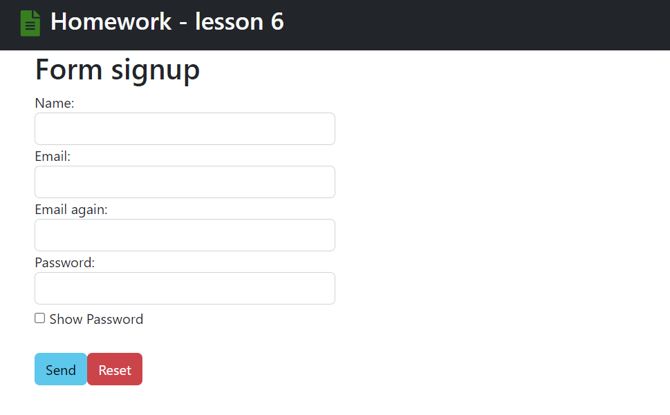
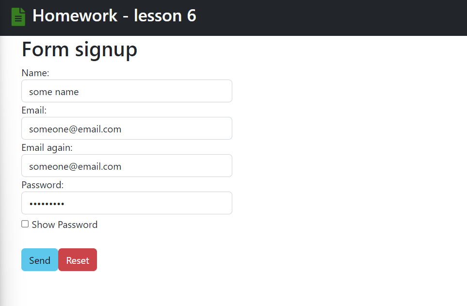
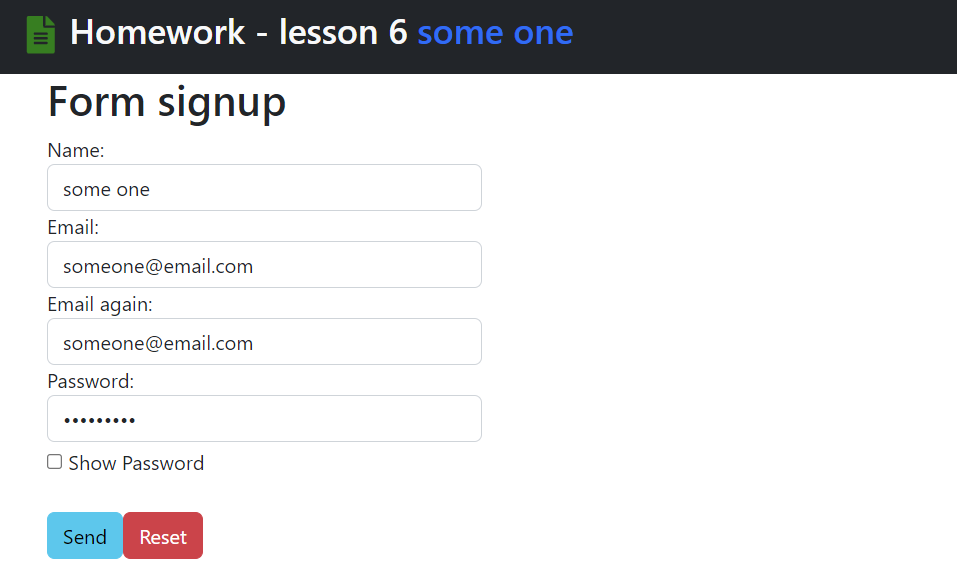
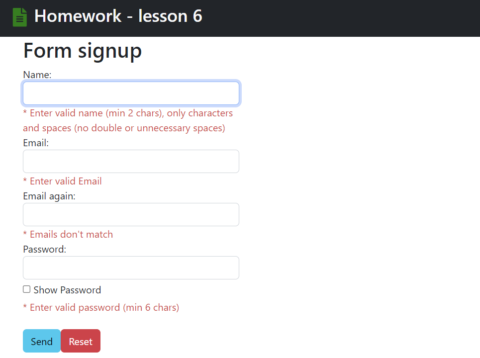
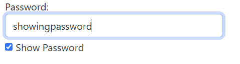
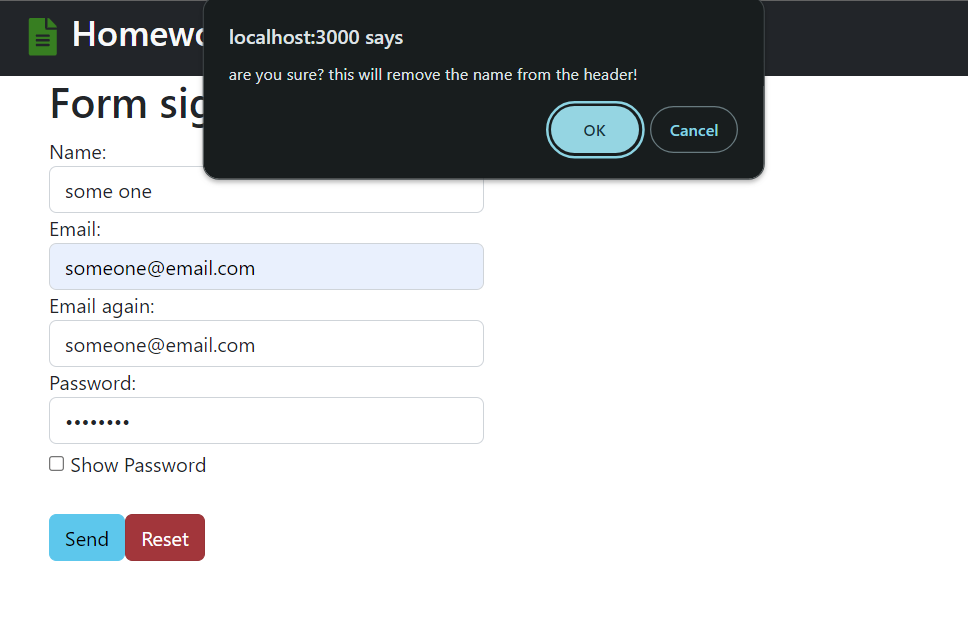
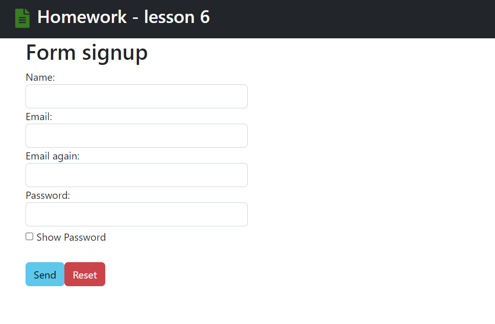
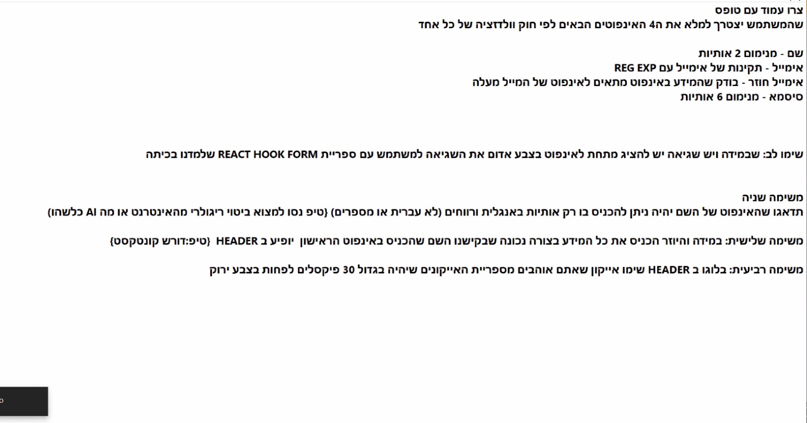

# Project view:

> if input is valid the name will be shown in header:

> othrewise each error will be displayed:

> show password checkbox

# reset:

> [!NOTE]
> MESSAGE WILL BE SHOWN ONLY IF FORM IS DIRTY!!

> after pressing ok:
> 

# Task Instructions

